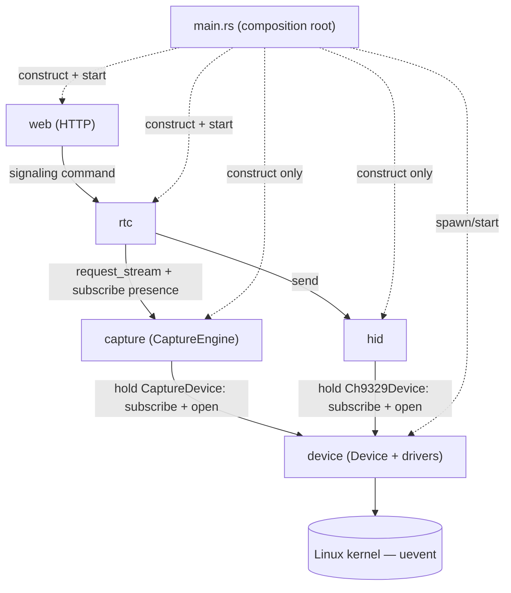

# ARCHITECTURE.md

> Source of truth for module boundaries, ownership, and communication.
> Any change that crosses a boundary here must update this document **first**, then the code.
> Device/capture internals reflect `docs/capture-redesign-ideas.md` (the target rewrite).

---

## 1. What this system is

A Linux service that turns a target machine into a browser-controllable KVM: it streams a **capture card's**
video to a browser over **WebRTC**, forwards the browser's **keyboard/mouse** to the target through a
**CH9329** USB-to-serial HID bridge, and reacts to hardware being **plugged/unplugged** at runtime. The
design mirrors the browser's own device/track model (`mediaDevices`/`getUserMedia`/`MediaStreamTrack`/
`EventTarget`), except the **server** owns the physical devices.

---

## 2. Invariants (non-negotiable)

- **I1 — One composition root.** `main.rs` only *constructs* modules and *wires* dependencies. No domain logic, no config values, no path strings.
- **I2 — Config is module-local.** Every module loads its **own** config — including its device path(s), read from its own env/config, never passed in by `main`.
- **I3 — Device paths are secret.** Only the `device` module knows or references an OS device path. Every other module reaches a device only through `Device::open()`, which returns an OS handle, **never the path**.
- **I4 — Two communication patterns only.** **Events** (callback subscriptions, `EventTarget`-style) and **commands** (async API call returning a typed result). No shared mutable globals, no reaching into another module's internals.
- **I5 — Dependencies point one way.** The graph in §4 is a DAG. No cycles, no unlisted edges.
- **I6 — Transport carries no domain logic.** The `web` module is thin HTTP: parse request → call an API → serialize response.

---

## 3. Modules

Each module lists what it is **responsible for**, **owns exclusively**, **may depend on**, and **must not** do.

### 3.1 `device` — presence & capability tracking (mirrors `navigator.mediaDevices`)

- **Responsible for:** detecting plug/unplug, probing a device's capabilities when it appears, and notifying subscribers. **Sole owner of every OS device path.**
- **How it works:** a generic `Device<D: DeviceDriver>` core (presence task + event dispatch + path encapsulation) plus per-kind **drivers** (`CaptureDriver`, `Ch9329Driver`, future UART). One instance per physical device; each reads its own path from its own config. `Device::open()` is the only path-touching call and hands back an OS handle, never the path.
- **Owns exclusively:** all device paths and path→device mapping; the generic core **and** the drivers (their `probe`/`open` is the only code that touches a path or does a raw OS open); the `devicechange` events; `open()`; the kernel uevent listener; and the `EventEmitter`/`Subscription` pair (§5.1), which it **re-exports** publicly because every `add_event_listener` in the codebase hands back a `Subscription`.
- **May depend on:** the OS/kernel only. Leaf of the graph.
- **Must not:** encode, negotiate, speak the CH9329 protocol, or run HTTP.

> ```
> trait DeviceDriver { type Info; type Settings; type Open;
>     fn probe(path: &str) -> Option<Self::Info>;
>     fn open(path: &str, s: &Self::Settings) -> Result<Self::Open, OpenError>; }
> type CaptureDevice = Device<CaptureDriver>;   // wraps v4l2
> type Ch9329Device  = Device<Ch9329Driver>;    // wraps serial
> ```
> A new device kind is one more `DeviceDriver` impl, not another presence module.

### 3.2 `capture` — encode pipeline (mirrors `getUserMedia`)

- **Responsible for:** turning capture settings into a per-consumer video stream.
- **How it works:** `CaptureEngine` holds a `CaptureDevice`. `request_stream(settings) -> CaptureStream` opens via the Device API and returns a per-consumer stream (= `MediaStreamTrack`) carrying an `ended` event; it fails the same way `open()` does when the device is absent.
- **Owns exclusively:** the encode loop, the frame bus the encode pass publishes to, the `CaptureStream` type and its `ended` signal, and the current capture settings (held in memory). The bus stays private; only `FrameEnvelope`, the frame a session pulls off a stream, is re-exported.
- **May depend on:** `device` (holds a `CaptureDevice`: subscribe + `open`).
- **Must not:** know the device path; talk to `rtc`/`hid`/`web`; own peer sessions.

### 3.3 `hid` — CH9329 keyboard/mouse bridge

- **Responsible for:** sending HID messages to the CH9329 in the order received.
- **How it works:** holds a `Ch9329Device`, opens its channel through the Device API, and drains an internal **queue** to the CH9329 FIFO via one worker (spawned internally when the channel opens — not by `main`).
- **Owns exclusively:** the CH9329 wire protocol/framing, the message queue, and the drain worker.
- **May depend on:** `device` (holds a `Ch9329Device`: subscribe + `open`).
- **Must not:** know the device path; expose the raw serial channel; talk to `rtc`/`web`/`capture`.

### 3.4 `rtc` — peer session manager

The module is named `rtc`, not `webrtc`: a module called `webrtc` would shadow the `webrtc` crate it
depends on.

- **Responsible for:** managing peer sessions, producing an answer from an offer, and controlling **when** media is negotiated.
- **How it works:** exposes a signaling API (offer → answer) that `web` calls. It attaches a video track **only after** a session is `Connected` **and** the capture device is available (subscribes to presence through `CaptureEngine::add_event_listener`, calls `capture.request_stream`, renegotiates), and removes it on that stream's `ended` event. Peer input goes straight to the `hid` API.
- **Owns exclusively:** peer session state, signaling/renegotiation logic, and media-negotiation timing.
- **May depend on:** `capture` (`request_stream` + presence subscription), `hid` (send).
- **Must not:** run the HTTP server, touch device paths, hold a `Device` handle, or implement capture/HID logic.

### 3.5 `web` — HTTP transport & signaling front door

- **Responsible for:** serving the page on a given port and exposing endpoints that establish a WebRTC connection.
- **How it works:** an endpoint receives an offer, calls the `rtc` signaling API for an answer, and returns it. Pure transport.
- **Owns exclusively:** the HTTP server, routing, static assets, and request/response (de)serialization.
- **May depend on:** `rtc` (command) only.
- **Must not:** generate an answer, hold session/media state, validate on another module's behalf, or talk to `device`/`capture`/`hid`.

### 3.6 `main.rs` — composition root

- **Constructs:** the two `Device` instances, `CaptureEngine`, `hid`, `rtc`, `web`.
- **Wires:** `CaptureEngine(capture_device)`, `hid(ch9329_device)`, `rtc(capture_engine, hid)`, `web(rtc)`.
- **Starts:** the device presence tasks (via `spawn`), `rtc`, `web`. `CaptureEngine` is a passive factory; `hid` spawns its own worker when its channel opens.
- **Must not:** configure any module, pass any device path (each `Device` reads its own), or contain domain logic.

---

## 4. Dependency graph

`A --> B` means **A may depend on B**. DAG; no other edges.



| From | To | Kind |
|------|-----|------|
| `capture` | `device` | holds `CaptureDevice` — subscribe + `open` |
| `hid` | `device` | holds `Ch9329Device` — subscribe + `open` |
| `rtc` | `capture` | command (`request_stream`) + subscribe presence |
| `rtc` | `hid` | command (send) |
| `web` | `rtc` | command (signaling) |
| `main` | all | construct/wire/start only |

**There is no `rtc → device` edge.** Sessions learn about the capture card through
`CaptureEngine::add_event_listener`, which forwards the `Device<CaptureDriver>` events of the device
the engine already holds. One module owning the device handle and re-exposing its events is one edge
fewer than `rtc` holding a second handle, so `rtc` must not grow one. `rtc` does name
`device::DeviceStatus` and `device::Subscription`, but those are type-only imports — the payload
type and the handle type of the subscription it gets from `capture` — not a dependency edge.

Anything not in this table is a violation — including `web → device/capture/hid`, `capture → rtc`,
`hid → rtc`, and any edge into `device` other than subscribe/open.

---

## 5. Communication patterns

### 5.1 Events — callback subscriptions (`EventTarget`-style) **[decided]**

- One `EventEmitter<T>` per event kind (typed payload; a mismatch is a compile error, not a silent no-op). Publishers include `Device` (`devicechange`) and `CaptureStream` (`ended`).
- The emitter is **not** a shared utility module: it lives in `device` (§3.1), whose `devicechange` events are its reason to exist, and is re-exported from there. `capture` and `rtc` reach it over the `capture → device` / type-only-`device` imports they already have, so it costs no extra edge.
- `add_event_listener(cb) -> Subscription`. The `Subscription` **auto-deregisters on drop** (mirrors `removeEventListener`) — no manual cleanup to forget, no listener left calling into dropped state.
- `dispatch` fires each listener via its own `tokio::spawn`, **fire-and-forget, no join**, so one slow or broken listener can't stall another listener or the caller.
- **Not** a pull-based `watch` channel, and **not** Rayon/OS-thread dispatch — that path (see `docs/parallel-event-callbacks-rust.md`) was evaluated and rejected because these callbacks are async I/O, not CPU-heavy. If a specific listener body *is* CPU-heavy, wrap it in `spawn_blocking`/Rayon rather than changing the dispatch model.

### 5.2 Commands — direct API

- A caller invokes a callee's public async API (expressed as a **trait/port**) and awaits a typed result or error: `device.open(settings)`, `capture.request_stream(settings)`, `hid.send(msg)`, `rtc.handle_offer(offer)`.

---

## 6. Lifecycle

1. `main` spawns both `Device`s (each reads its own path, begins its presence task), constructs and wires the rest, and starts `rtc` and `web`.
2. Capture card plugged → `CaptureDevice` probes → dispatches `devicechange`, which `CaptureEngine` forwards to its own subscribers. For each `Connected` session, `rtc` calls `capture.request_stream`, `add_track`s, and renegotiates; the encoder starts.
3. Browser hits the `web` signaling endpoint → `web` calls `rtc.handle_offer` → returns the answer.
4. Peer input arrives → `rtc` calls `hid.send` → HID's queue drains in order.
5. Card unplugged → every live `CaptureStream` fires `ended` → each session `remove_track`s + renegotiates → the encoder stops.
6. **Shutdown needs no special path.** Runtime shutdown drops each session task, whose destructors drop the peer connection, video track, and `CaptureStream` together — the same **ownership cascade** as one browser disconnecting. `CaptureEngine` does keep a live count (`LiveCount { count, pass_running }`), but it is decremented from `LiveMarker`'s `Drop`, so it is driven by ownership rather than by callers remembering to decrement. The encoder stops when that count reaches zero, which happens as part of the cascade.

---

## 7. Cross-cutting rules

- **Config & paths:** each module loads its own config; each `Device` reads its own path. `rg '/dev/'` matches only inside the `device` module (see §8 check 1 for the exact command).
- **Errors:** typed per module; callers handle them. No panics or `unwrap()` on fallible I/O in library code.
- **Async:** all waits are async; never block an async task, never hold a lock across `.await`.
- **Handles:** OS handles expose I/O only; they never expose or stringify the path.

---

## 8. Enforcement

The `device` module is a directory (`src/device/`); check 1 excludes both that and the older
single-file spelling (`src/device.rs`) so it keeps working either way. The same applies to any
other module named below.

1. **Path secrecy (I3):** `rg '/dev/' src --glob '!src/device.rs' --glob '!src/device/**'` returns nothing, and so does the same search for device `*_PATH` env reads (`rg '_PATH' src --glob '!src/device.rs' --glob '!src/device/**'`).
2. **Dependency edges (I5):** each module's cross-module `use crate::` matches only §4. `web` imports only `rtc`; `capture`/`hid` import only `device`; `rtc` imports only `capture` and `hid` (plus `device::DeviceStatus` and `device::Subscription`, the type-only payload and handle of the subscription `capture` hands it — see §4); `device` imports no sibling.
3. **Config locality (I2):** module config, paths included, is defined and read inside that module; `main.rs` has no config literals or path strings — `rg 'env::var|/dev/' src/main.rs` returns nothing.
4. **Composition root (I1):** `main.rs` is construct/wire/start only.
5. **Web is thin (I6):** no SDP/media/HID logic in `web`; every handler ends in an `rtc` call. The HTTP server itself lives in `web` — `rg 'axum|TcpListener' src --glob '!src/web/**'` returns nothing.

### Recommended structure

A Cargo **workspace with one crate per module** (`device`, `capture`, `hid`, `rtc`, `web`, thin `main`) makes I5 a **compile error** on violation and each crate's public API exactly its port. The generic `Device<D>` core and all `DeviceDriver` impls live in the `device` crate. Single-crate is possible with `pub(crate)` discipline plus the checks above.