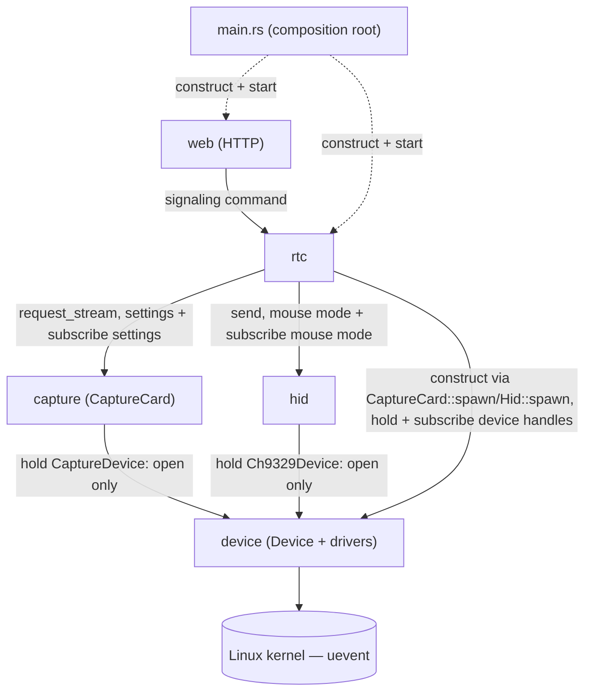

# ARCHITECTURE.md

> Source of truth for module boundaries, ownership, and communication.
> Any change that crosses a boundary here must update this document **first**, then the code.
> Device/capture internals reflect `docs/capture-redesign-ideas.md` (the target rewrite).

---

## 1. What this system is

A Linux service that turns a target machine into a browser-controllable KVM: it streams a **capture card's**
video to a browser over **WebRTC**, forwards the browser's **keyboard/mouse** to the target through a
**CH9329** USB-to-serial HID bridge, and reacts to hardware being **plugged/unplugged** at runtime. The
design mirrors the browser's own device/track model (`mediaDevices`/`getUserMedia`/`MediaStreamTrack`/
`EventTarget`), except the **server** owns the physical devices.

---

## 2. Invariants (non-negotiable)

- **I1 — One composition root, per level.** `main.rs` is the top-level composition root: it constructs `rtc` and `web` and wires them. No domain logic, no config values, no path strings. `rtc` is itself a composition root for its own dependencies — it constructs `capture` and `hid` as part of building itself, the same way `main.rs` builds `rtc` and `web`. Logging setup and the startup banner are `main.rs`'s single deliberate exception (§7).
- **I2 — Config is module-local.** Every module loads its **own** config — including its device path(s), read from its own env/config, never passed in by `main`.
- **I3 — Device paths are secret.** Only the `device` module knows or references an OS device path. Every other module reaches a device only through `Device::open()`, which returns an OS handle, **never the path**.
- **I4 — Two communication patterns only.** **Events** (callback subscriptions, `EventTarget`-style) and **commands** (async API call returning a typed result). No shared mutable globals, no reaching into another module's internals.
- **I5 — Dependencies point one way.** The graph in §4 is a DAG. No cycles, no unlisted edges.
- **I6 — Transport carries no domain logic.** The `web` module is thin HTTP: parse request → call an API → serialize response.

---

## 3. Modules

Each module lists what it is **responsible for**, **owns exclusively**, **may depend on**, and **must not** do.

### 3.1 `device` — presence & capability tracking (mirrors `navigator.mediaDevices`)

- **Responsible for:** detecting plug/unplug, probing a device's capabilities when it appears, and notifying subscribers. **Sole owner of every OS device path.**
- **How it works:** a generic `Device<D: DeviceDriver>` core (presence task + event dispatch + path encapsulation) plus per-kind **drivers** (`CaptureDriver`, `Ch9329Driver`, future UART). One instance per physical device; each reads its own path from its own config. `Device::open()` is the only path-touching call and hands back an OS handle, never the path.
- **Owns exclusively:** all device paths and path→device mapping; the generic core **and** the drivers (their `probe`/`open` is the only code that touches a path or does a raw OS open); the handle types their `open` hands back (`CaptureHandle`, the CH9329's serial port) and the capture types the capture driver produces (`Resolution`, `SupportedFormat`, `CaptureSettings` — `capture` re-exports these as part of its own API); the `devicechange` events; `open()`; the kernel uevent listener; and the `EventEmitter`/`StateEmitter`/`Subscription` set (§5.1), which it **re-exports** publicly because every `add_event_listener` in the codebase hands back a `Subscription`.
- **Handles carry what only the open could learn.** `CaptureHandle` is an already-open V4L2 device plus the resolution the driver *actually negotiated*, which is free to differ from the requested one. The negotiated value is the only one the encode loop can see, because buffers sized from the requested one read past the end of a real frame.
- **`is_present()` alongside `open()`.** A real open is neither free nor repeatable — negotiating a format can only be done by one holder at a time — so presence is also queryable on its own, for callers that must reject early (`getUserMedia`-style) without opening. It reads the same stored value the `devicechange` `StateEmitter` replays (§5.1), so what a caller reads and what subscribers were told are one thing, not two that can drift.
- **A subscriber that arrives late is still told.** `spawn` starts the presence task before its caller can subscribe, so the first status can be published with nobody listening; the `StateEmitter` replays it on subscribe. Without that, a module learns the device is there only on the *next* transition — for a device that stays plugged in, never.
- **Presence is noticed immediately; probing waits.** Real hardware (both the capture card and the CH9329) has crashed when probed/opened too soon after USB enumeration, including right at boot if the device was already plugged in. Rather than skipping the probe on just that first check, every absent→present transition is treated the same way: it's logged the instant it's seen, then the core waits a fixed `DETECT_TO_PROBE_DELAY` (3 seconds) before calling `D::probe` and dispatching `Present`. This is generic — one delay, applied uniformly to every `DeviceDriver`, not a per-device-kind workaround.
- **May depend on:** the OS/kernel only. Leaf of the graph.
- **Must not:** encode, negotiate, speak the CH9329 protocol, or run HTTP.

> ```
> trait DeviceDriver { type Info; type Settings; type Open;
>     const UEVENT_SUBSYSTEM: &str;                  // "video4linux" / "tty"
>     const PATH_ENV_VAR: &str; const DEFAULT_PATH: &str;
>     fn probe(path: &str) -> Option<Self::Info>;
>     fn open(path: &str, s: &Self::Settings) -> Result<Self::Open, OpenError>; }
> type CaptureDevice = Device<CaptureDriver>;   // wraps v4l2
> type Ch9329Device  = Device<Ch9329Driver>;    // wraps serial
> ```
> A new device kind is one more `DeviceDriver` impl, not another presence module.
>
> **Where a device lives is stated by its driver, not by its caller.** The uevent subsystem and
> the path (env var + default) describe a device *kind*, so `Device::spawn()` takes no arguments
> at all — which is what makes it impossible for a caller to hold a path (I2/I3).

### 3.2 `capture` — encode pipeline (mirrors `getUserMedia`)

- **Responsible for:** turning capture settings into a per-consumer video stream, and holding those settings.
- **How it works:** `CaptureCard::spawn()` builds the engine and its `CaptureDevice` together (`Self::new(CaptureDevice::spawn())`), so a caller that just wants a working engine — `rtc`, now that it constructs its own dependencies (§3.4/§3.6) — never has to touch `device` itself to get one. `CaptureCard` holds a `CaptureDevice`, but never subscribes to it — it only ever calls `open()`. `request_stream() -> Result<CaptureStream, OpenError>` (mirrors `getUserMedia()`'s promise) is genuinely fallible: if no pass is currently running, the call itself is what attempts the open — awaited, not backgrounded — and returns `Err` straight from that attempt if it fails (device absent, or a real negotiate failure), with no stream/track ever created for that call. If a pass is already running (an earlier `request_stream` already opened the device and is streaming), a new call joins it and returns `Ok(CaptureStream)` immediately, without a second open. It takes no settings — the engine owns them, and a pass is shared by every consumer, so there is only ever one set in play (see `update_settings`). The device itself is opened **once per encode pass**, on its own blocking thread — not once per consumer: a second consumer joining a running pass must not re-open and re-negotiate a device that is already streaming.
- **`ended` is for the pass dying *after* it already started — never for the open itself, and never from a device-presence subscription.** An open that fails is reported directly as the `Err` from `request_stream()` (see above) — no stream exists yet to fire anything on. `ended` is what a stream that *did* start gets, mirroring the browser's own `MediaStreamTrack`: it fires because reading from its own source failed (`v4l2::run_capture_loop`'s blocking read erroring out — the mid-stream-unplug case), not because something told it the device list changed. `ended` is still published through a `StateEmitter` (§5.1), not a plain one: a consumer gets its stream back and then does await-heavy work before it subscribes (a WebRTC session adds and negotiates a video track in between), so a pass that dies fast right after starting can end the stream inside that window; subscribing after that still calls the listener straight away instead of registering one that can never fire. A deliberate stop — the last stream dropping, so the live count hits zero — is still not `ended`, and there is still no retry or backoff: a dead pass stays dead until something calls `request_stream()` again (now `rtc`'s job, see §3.4 — it decides when that's worth trying).
- **Opening is consumer-triggered, always.** The first `request_stream` is what causes an open; presence detection and probing never do. This is a hardware constraint, not a preference — opening the card unprompted at boot has crashed the real device (see §3.1's detect-to-probe delay, which covers probing, not this).
- **Settings are the engine's, in memory, never on disk.** `settings()` reads them, `update_settings(new)` applies them, marks them as a person's own choice, and fires a settings-changed event so every open tab updates live. A format is negotiated at open time, so changing settings under a running pass is impossible: the engine stops that pass and the pass's own supervisor starts the replacement once the old one has actually let go of the card. Before the device has ever been probed, the in-memory settings hold a placeholder value only — never encoded, since no session can attach video before a successful probe (§3.4) — and are superseded the moment a real default is available. `capture` still owns the settings themselves and the bookkeeping that tells a default apart from a person's own choice, but it no longer computes *what* a capability-driven default should be, and no longer falls back to any fixed resolution/frame-rate constant of its own once real capabilities are known — `rtc` is the only thing that knows the card's probed capabilities (§3.4), so `apply_default_settings(new)` is how it hands one down: it applies `new` and fires the same settings-changed event, but — unlike `update_settings` — never marks the result as a person's own choice, and is a no-op once a person has actually picked settings by hand (issue #032).
- **`device()` hands out the same `CaptureDevice` it holds, for direct use elsewhere.** `rtc` needs presence and capabilities to gate when it attaches a video track and to drive the settings dropdown (§3.4); it gets that by subscribing to this same device handle directly, not by asking `capture` to forward anything. Cloning `CaptureDevice` doesn't start a second presence task — it shares the one `Device::spawn()` already running (§3.1).
- **Owns exclusively:** the encode loop (driven from the `CaptureHandle`, sizing its buffers from that handle's negotiated resolution; the format it negotiates against is read fresh from the `CaptureDevice`'s own `latest_status()` at pass-start time, a query rather than a subscription — §5.1's "ask without subscribing" contract, same as `is_present()`), the frame bus the encode pass publishes to, the `CaptureStream` type and its `ended` signal, and the current capture settings (held in memory), their change event, and the default-vs-chosen bookkeeping behind `apply_default_settings`/`update_settings`. The bus stays private; only `FrameEnvelope`, the frame a session pulls off a stream, is re-exported.
- **May depend on:** `device` (holds a `CaptureDevice`: `open` and `latest_status()` only — it doesn't subscribe to it).
- **Must not:** know the device path; read or write settings to disk; talk to `rtc`/`hid`/`web`; own peer sessions; compute `DeviceState` or track device presence/capabilities itself (moved to `rtc`, §3.4); decide *what* a capability-driven default should be (also `rtc`'s job, §3.4) — it only applies whatever `rtc` hands it.

### 3.3 `hid` — CH9329 keyboard/mouse bridge

- **Responsible for:** turning input — a key going down or up, the pointer moving, buttons held, the wheel moved, text to type — into CH9329 reports, and sending them in the order received.
- **How it works:** `Hid` spawns its own `Ch9329Device` and drain worker immediately, the same way `CaptureCard` holds its `CaptureDevice` from construction — the boot-crash mitigation lives once, generically, in `device`'s detect-to-probe delay (§3.1), not as a second delay of this module's own. Commands submitted before the CH9329 is actually found queue rather than fail, so nothing else's startup waits on it. The worker does not subscribe to presence at all any more — it is purely command-driven, the same as `capture` (§3.2): for each command it drains from the queue, it uses an already-open port or, if it doesn't have one, opens the CH9329 through the Device API (`Device::open`, the module's only open path) and writes. That either works, or fails with whatever error `Device::open`/the write itself gives — logged, and the worker just moves on to the next command rather than pausing the queue. A successfully-opened port is kept and reused across commands instead of reopened every time; a failed write drops it, so the next command tries to open fresh. That's what notices a replug — not a subscription — and a command that fails while the device is gone is simply lost, not held for later: a stale keypress or pointer move replayed after a replug wouldn't be correct input anyway.
- **Public surface:** `send(InputCommand)`, `device() -> Ch9329Device` (hands back the same device handle this module holds, for direct presence use elsewhere — see `rtc`, §3.4), and `mouse_mode()`/`set_mouse_mode()`/`add_mouse_mode_listener(cb)` — nothing else. No channel sender, no serial handle, no path escapes it. `InputCommand` names a browser `KeyboardEvent.code` or a pointer position; the translation into reports (keymap lookup, held-key tracking, report assembly, framing) happens on the way to the port.
- **Owns exclusively:** the CH9329 wire protocol/framing, the browser-code→HID-usage keymap, the held-key state and the six-key rollover it implies, the mouse mode (in memory, with a change event), the message queue, and the drain worker.
- **Lifetime by ownership:** `Hid` holds the only strong queue sender, so dropping it closes the queue, which ends the worker.
- **May depend on:** `device` (holds a `Ch9329Device`: `open` only — it no longer subscribes to it, not even for its own use).
- **Must not:** know the device path; expose the raw serial channel or its queue; expose a usage code, a modifier bitmask or a report shape to a caller; talk to `rtc`/`web`/`capture`; subscribe to its own device's presence (that's `rtc`'s job now, via `device()`, see §3.4).

> Held-key state is per **CH9329**, not per session: the chip presents one keyboard to the target, so one `Keyboard` lives in the drain worker and every session's keystrokes fold into it.

### 3.4 `rtc` — peer session manager

The module is named `rtc`, not `webrtc`: a module called `webrtc` would shadow the `webrtc` crate it
depends on.

- **Responsible for:** managing peer sessions, producing an answer from an offer, controlling **when** media is negotiated, and (now) tracking capture-card/CH9329 presence and capabilities for the UI — `DeviceState` and HID-available state moved here from `capture`/`hid` so neither of those has to subscribe to its own device just to report on itself (§3.2/§3.3).
- **How it works:** exposes a transport-free signaling command (`handle_offer(offer_sdp) -> Result<answer_sdp, SignalingError>`) that `web` calls; it names no HTTP type and imports nothing from the HTTP framework, so the status code and the JSON shapes are `web`'s business alone. It holds its own `CaptureDevice`/`Ch9329Device` handles — clones of the exact same ones `capture`/`hid` hold, obtained via `capture.device()`/`hid.device()`, not a second `Device::spawn()` (§3.1's "one instance per physical device" still holds) — and subscribes to their presence directly; it is now the **only** module that subscribes to device presence at all (`capture` and `hid` are purely command-driven, §3.2/§3.3).
- **Presence updates the dropdown, but never by itself creates or destroys a video track.** `rtc`'s `devicechange` listener on its own `CaptureDevice` handle is what reacts to a plug/unplug. On a `Present` event, the payload already carries the probed `Info` (resolutions, frame rates) — `device` probed it before dispatching (§3.1), so `rtc` never makes a separate probe call. `rtc` recomputes `DeviceState` from that `Info` plus `capture.settings()` and pushes it down every session's `control` channel — that is all a `Present` event does on its own; it does **not** call `capture.request_stream()`, because a track nobody can receive isn't worth having (see the next bullet, and `capture`'s "encoder runs iff live handles > 0", §3.2/§6). On an `Absent` event, `rtc` recomputes `DeviceState` (`available: false`), pushes it the same way, and forwards the `Absent` status to every session — each session that currently holds a video track reacts to this on its own, removing that track and renegotiating (see the next bullet).
- **Applying a capability-driven default is process-level, not per-session.** `Rtc` itself — not any one session — holds one more subscription on its own `CaptureDevice` handle, kept alive for the life of the process (`ARCHITECTURE.md` §6 point 7's shutdown cascade covers it the same as everything else `Rtc` holds): on a `Present(Some(info))` event, it computes `info`'s own first reported resolution and that resolution's own first reported frame rate, and hands the result to `capture.apply_default_settings(new)`. This has to run once regardless of how many sessions are connected — including zero — since it's establishing what the *applied* setting is, not something scoped to any one tab; `capture.apply_default_settings` (§3.2) is what makes this safe to call as often as presence changes, since it no-ops once a person has picked settings by hand. No fixed resolution/frame-rate value is ever computed or preferred here — only what the device itself just reported (issue #032).
- **Every session gets its own `CaptureStream`, sharing one encode pass underneath — mirrors handing out separate `MediaStreamTrack` clones of the same camera, each with its own independent playback position.** `rtc` does not cache or hand out a single shared stream object; every session that wants video calls `capture.request_stream()` for itself, once, when it reaches `Connected` while the card is present *and successfully probed* (`DeviceStatus::Present(Some(_))`, not merely `Present(_)`) — a present device that never probed successfully means no `Info` and no `DeviceState` ever got published for it, so there is nothing to gate a `request_stream()` attempt on, and the existing detect-to-probe delay already exists precisely to avoid probing/opening too early; a one-time probe failure right after hot-plug is thus a real, accepted tradeoff — no `request_stream()` is attempted until the next replug. This still guarantees only one real device open and one running encode pass at a time: `capture`'s own live-consumer count (§3.2) is what dedups every session's call down to a single pass, not anything `rtc` tracks itself — a second session's call while a pass is already running shares that same pass without a second device open. Giving every session its own `CaptureStream`, rather than one object shared by reference, is a correctness requirement, not just a simplicity choice: each stream holds its own private read position into the underlying frame feed, so two sessions sharing the exact same stream object would each only see every *other* frame instead of every frame — independent per-call streams are what keep every tab's video smooth. When a session stops holding its track (it disconnects, or otherwise loses it), it alone drops its own `CaptureStream`; once every session sharing that pass has done the same, `capture`'s live count reaches zero and the encoder stops on its own — even though the card may still be plugged in — with nothing at the `rtc` level needing to count how many sessions currently hold one. Each session's own stream `ended` event (the pass dying after a successful start, §3.2), and a capture-`Absent` event (previous bullet), are both handled the same way, independently, by every session that currently holds a track: it removes that track and renegotiates. Whichever of the two fires first for a given session, the other is a no-op for it — removing a track a session doesn't have does nothing.
- Peer input goes straight to the `hid` API, described in input terms (`InputCommand`) — no keymap lookup, no modifier bitmask, no report shape — and unconditionally: a send that fails because the CH9329 is gone is `hid`'s own concern (§3.3), not something `rtc` checks for first. Capture settings are read from and written to `capture`; `DeviceState` (available, resolutions, frame rates) is computed here, from the capture card's probed capabilities (via its `CaptureDevice` handle) plus `capture.settings()` — `capture` no longer computes or holds this at all. HID-available state is read here straight off its `Ch9329Device` handle, not from `hid`. The page's Save button becomes a `CaptureCard::update_settings`/`Hid::set_mouse_mode` call, and the state pushed down a session's `control` channel is a mix of what `capture`/`hid` report (settings, mouse mode) and what `rtc` computes itself (`DeviceState`, HID-available).
- **Events and commands, per session, nothing pre-wired** — apart from the one process-level default-settings subscription above, which exists once for the whole `Rtc`, not per session. `Rtc` — the object `main` builds and `web` holds as router state — is the `CaptureCard` handle, the `Hid` handle, and the `CaptureDevice`/`Ch9329Device` handles obtained from them. There is no shared bundle of channels between it and a session: each session **subscribes for itself** to capture settings, capture device presence, HID presence and mouse mode when it starts, reads the current value of all four straight from the owning handle when its `control` channel opens (an event only fires on a change, so it says nothing about what was already true), and calls a command to apply one. The subscriptions are **owned by the session**, so they deregister when it ends (see §5.1).
- **Every outbound `control` message goes through the session's own queue.** One task writes to `control`; the event callbacks enqueue onto it rather than writing to `control` themselves, so two producers can never reorder same-type updates on the wire. Because listeners are dispatched fire-and-forget on their own tasks, two changes in quick succession can run in either order, so a callback re-reads the current value from the owning module/handle instead of trusting the payload it was handed — the worst case is then a duplicate of the current value rather than a tab stuck on a stale one.
- **Owns exclusively:** peer session state, signaling/renegotiation logic, media-negotiation timing, each session's outbound `control` queue, and the `DeviceState`/`ResolutionFrameRates` types plus their computation.
- **Builds its own dependencies.** `Rtc::spawn()` is what `main.rs` calls; it constructs `CaptureCard::spawn()` and `Hid::spawn()` internally, takes its own `CaptureDevice`/`Ch9329Device` handles from them, and wires all of it into the `Rtc` it returns, the same way `main.rs` used to build them directly. Composition of `rtc`'s own dependencies moved down a level so `main.rs` only ever constructs `rtc` and `web` (§3.6).
- **May depend on:** `capture` (`request_stream`, settings/`update_settings`, and subscribing to settings-changed — no longer device state), `hid` (send, mouse mode, and subscribing to mouse-mode-changed — no longer presence), `device` (constructs its own `capture`/`hid` dependencies via `CaptureCard::spawn()`/`Hid::spawn()`, and holds/subscribes to the `CaptureDevice`/`Ch9329Device` handles it gets back from them for presence and probing).
- **Must not:** run the HTTP server, import the HTTP framework, touch device paths, spawn a second `Device` instance for a device `capture`/`hid` already holds, or implement capture/HID logic — including translating keys or assembling reports.

### 3.5 `web` — HTTP transport & signaling front door

- **Responsible for:** serving the page on its own configured port and exposing endpoints that establish a WebRTC connection.
- **How it works:** `serve(rtc)` reads this module's own port (`HTTP_PORT`, default `3000` — I2, same as any other module's config), binds the listener and runs the server; `main` only calls it. An endpoint receives an offer, calls `rtc.handle_offer` for an answer, and returns it — mapping a `SignalingError` to `400`, the only failure status the browser ever sees here. Pure transport.
- **Owns exclusively:** the HTTP server and its port config, the listener, routing, static assets, and request/response (de)serialization — including the offer/answer wire shapes, which are HTTP payload types, not `rtc` types.
- **May depend on:** `rtc` (command) only.
- **Must not:** generate an answer, hold session/media state, validate on another module's behalf, or talk to `device`/`capture`/`hid`.

### 3.6 `main.rs` — composition root

- **Constructs:** `rtc`, `web`.
- **Wires:** `web(rtc)`. `rtc::Rtc::spawn()` builds and wires its own `capture`/`hid` dependencies internally (§3.4) — `main.rs` no longer names `CaptureDevice`, `CaptureCard` or `Hid` at all.
- **Starts:** the page server (via `web::serve`, which owns the port and the listener). `Rtc::spawn()` is constructed, not started — a session begins when an offer arrives. Building it is what starts the capture card's presence task and `Hid`'s own device/drain worker, since those now happen as part of `rtc` constructing its own `capture`/`hid` dependencies.
- **Plus, deliberately:** logging setup and the startup banner, and nothing else — see §7 for why they stay.
- **Must not:** configure any module, pass any device path (each `Device` reads its own), or contain domain logic. It holds no environment read, no port, no default resolution/frame rate/mouse mode, and constructs no channel. It has no fallible step of its own — every error belongs to the module that can act on it — so `main` returns `()`, not a `Result`.

---

## 4. Dependency graph

`A --> B` means **A may depend on B**. DAG; no other edges.



| From | To | Kind |
|------|-----|------|
| `capture` | `device` | holds `CaptureDevice` — `open` only, no subscription |
| `hid` | `device` | holds `Ch9329Device` — `open` only, no subscription |
| `rtc` | `capture` | command (`request_stream`, `settings`/`update_settings`, `device()`) + subscribe settings-changed |
| `rtc` | `hid` | command (`send`, mouse mode, `device()`) + subscribe mouse-mode-changed |
| `rtc` | `device` | constructs its own `capture`/`hid` dependencies (`CaptureCard::spawn()`, `Hid::spawn()`); holds and subscribes to the `CaptureDevice`/`Ch9329Device` handles obtained from `capture.device()`/`hid.device()` for presence, probing, computing `DeviceState`/HID-available state, and forwarding an `Absent` event to every session so each can tear down its own video track if it holds one |
| `web` | `rtc` | command (signaling) |
| `main` | `rtc`, `web` | construct/wire/start only |

**`rtc` now keeps its own presence-tracking device handles — it is the only module that does.**
Earlier, `rtc → device` was allowed only because `rtc` constructs `capture`/`hid`, and sessions
learned about presence purely by `capture`/`hid` forwarding their own device's events. That
forwarding is gone, and so is the subscribing behind it: `capture` and `hid` are now purely
command-driven against their own device (`open` — plus, for `hid`, the write itself — either
succeeds or fails, nothing subscribes to know in advance). `rtc` instead takes a clone of each
device handle directly from `capture.device()`/`hid.device()` and subscribes to it itself — cloning
doesn't spawn a second presence task (§3.1), so this still respects "one instance per physical
device." This is why `rtc → device` is a fully allowed edge, not a type-only exemption: `rtc`
genuinely subscribes to and reads from `device`, not just names its types.

Anything not in this table is a violation — including `web → device/capture/hid`, `capture → rtc`,
`hid → rtc`.

---

## 5. Communication patterns

### 5.1 Events — callback subscriptions (`EventTarget`-style) **[decided]**

- One `EventEmitter<T>` per event kind (typed payload; a mismatch is a compile error, not a silent no-op). Publishers include `Device` (`devicechange`), `CaptureStream` (`ended` — from the pass dying, never a forwarded device-presence event, see §3.2), `CaptureCard` (settings changed only — no longer device state, see §3.4), and `Hid` (mouse mode changed only — no longer a forwarded `devicechange`, see §3.3). `rtc` is a direct subscriber of `Device`'s own `devicechange` now, through the `CaptureDevice`/`Ch9329Device` handles `capture`/`hid` hand it back (§3.4).
- The emitter is **not** a shared utility module: it lives in `device` (§3.1), whose `devicechange` events are its reason to exist, and is re-exported from there. `capture` and `hid` reach it to publish their *own* events (settings-changed, mouse-mode-changed) over the edges they already have to `device`; `rtc` reaches it to subscribe to `device`'s `devicechange` directly, over its own `rtc → device` edge (§4).
- `add_event_listener(cb) -> Subscription`. The `Subscription` **auto-deregisters on drop** (mirrors `removeEventListener`) — no manual cleanup to forget, no listener left calling into dropped state.
- `dispatch` fires each listener via its own `tokio::spawn`, **fire-and-forget, no join**, so one slow or broken listener can't stall another listener or the caller.
- **An event that reports *state* uses `StateEmitter<T>`, not `EventEmitter<T>`.** A plain emitter is edge-triggered: a dispatch reaches whoever is subscribed at that instant and nobody else. That is wrong wherever the publisher starts before its subscriber can attach, which is the case for two of them — a `CaptureStream`'s `ended` (the stream is handed back before the consumer subscribes, with an await-heavy `add_track` in between) and a `Device`'s `devicechange` (`Device::spawn` starts the presence task before its caller can subscribe). Both were losing that first event (issue #023). A `StateEmitter` remembers the value it last dispatched and replays it to a listener that subscribes afterwards, so a late subscriber learns where things stand instead of registering a callback that can never fire. It lives beside `EventEmitter` in `device` and is re-exported the same way. The guarantee is unchanged either way: **exactly one notification per subscriber** — from the dispatch or from the replay, never both — and none after that subscriber drops its `Subscription`. `latest()` exposes the same stored value to a caller that wants it without subscribing; `Device::is_present` is that call, which is why presence can never disagree with what subscribers were last told. `rtc` reads presence straight off the `CaptureDevice`/`Ch9329Device` handles it holds (`is_present()`) for a session's initial `control` push, so it never depends on catching an event it was too late for — same reasoning as before, just no longer mediated by `capture`/`Hid` forwarding it.
- **Not** a pull-based `watch` channel, and **not** Rayon/OS-thread dispatch — that path (see `docs/parallel-event-callbacks-rust.md`) was evaluated and rejected because these callbacks are async I/O, not CPU-heavy. If a specific listener body *is* CPU-heavy, wrap it in `spawn_blocking`/Rayon rather than changing the dispatch model.

### 5.2 Commands — direct API

- A caller invokes a callee's public async API (expressed as a **trait/port**) and awaits a typed result or error: `device.open(settings)` / `device.is_present()` / `device.probe()`, `capture.request_stream() -> Result<CaptureStream, OpenError>` / `capture.update_settings(new)` / `capture.device()`, `hid.send(input)` (itself fallible internally, logged rather than surfaced to the caller — §3.3) / `hid.set_mouse_mode(mode)` / `hid.device()`, `rtc.handle_offer(offer)`.

---

## 6. Lifecycle

1. `main` initialises logging and prints the banner (§7), constructs `rtc` (via `Rtc::spawn()`, which builds `capture`'s `CaptureCard`/`CaptureDevice` and `hid`'s `Hid` as part of building itself — see §3.4/§3.6) and `web`, wires them, and calls `web::serve`, which reads its own port, binds and runs until the process ends. The `CaptureDevice` reads its own path and begins its presence task as part of that construction (`rtc` is what subscribes to it, not `capture` itself — §3.4); `Hid` spawns its own `Ch9329Device` and drain worker immediately and accepts commands right away — a command that can't be opened/written is logged and dropped rather than held for a later replug (§3.3), since a stale keypress or pointer move wouldn't be correct input by then anyway.
2. Capture card plugged → `CaptureDevice` probes → dispatches `devicechange(Present(info))`, which `rtc` hears directly (it holds its own clone of the same `CaptureDevice` handle, via `capture.device()` — §3.4). `rtc` recomputes `DeviceState` from that `info` (no separate probe call) and pushes it to every session's `control` channel — nothing else happens yet if no session is connected. The actual `capture.request_stream()` call, and the `Device::open` → `CaptureHandle` it triggers, only happens the moment a session reaches `Connected` while the card is present *and* successfully probed (`DeviceStatus::Present(Some(_))` — a probe failure right after hot-plug means no auto-retry until replug, an accepted tradeoff): the first such session's call is what causes the real device open; every session after that — already connected or joining later — makes its own `request_stream()` call too, sharing the same running encode pass underneath (`capture`'s live count, §3.2) rather than sharing one stream object, so no session's video steals frames from another's.
3. Browser hits the `web` signaling endpoint → `web` calls `rtc.handle_offer` → returns the answer.
4. The session's `control` channel opens → it reads the current capture settings and mouse mode from `capture`/`hid`, computes `DeviceState`/HID-available itself from the `CaptureDevice`/`Ch9329Device` handles it holds, and pushes all of it to that tab, once. From then on its own subscriptions push every change, so an already-open tab follows a hot-plug or another tab's Save with no reload. The Save button itself is a command back the other way (`capture.update_settings` / `hid.set_mouse_mode`), and the change event that follows is what echoes it to every tab, including the one that saved.
5. Peer input arrives → `rtc` calls `hid.send` with what the peer did → the drain worker translates it into a CH9329 report and writes it, in order.
6. Card unplugged → two independent things happen, in whatever order the hardware/OS delivers them, and either one is enough to leave every session correct: (a) `rtc`'s own `CaptureDevice` handle sees the unplug's `devicechange(Absent)` — it recomputes `DeviceState` (`available: false`), pushes it to every session's `control` channel, and forwards the `Absent` status to every session, each of which independently removes its own video track (if it has one) and renegotiates; (b) each session's own `CaptureStream` (from its own `request_stream()` call, sharing the one running pass) has its next read fail the same way, ending the pass → every session sharing it gets its own `ended` event and reacts the same way, on its own. The encoder stops once every session sharing that pass has dropped its track (`capture`'s live count reaching zero, §3.2), and removing a track a session doesn't have is a no-op, so the two paths racing is harmless per session. A session leaving normally (not from an unplug) triggers the same drop on its own — once every session sharing that pass has done the same, the pass stops — even though the card may still be present, since a card with no session watching it shouldn't be encoding.
7. **Shutdown needs no special path.** Runtime shutdown drops each session task, whose destructors drop the peer connection, video track, `CaptureStream` and that session's four state subscriptions together — the same **ownership cascade** as one browser disconnecting. Dropping the subscriptions deregisters their listeners, which drops the last senders on that session's outbound queue, which ends its relay task. `CaptureCard` does keep a live count (`LiveCount { count, pass_running }`), but it is decremented from `LiveMarker`'s `Drop`, so it is driven by ownership rather than by callers remembering to decrement. The encoder stops when that count reaches zero, which happens as part of the cascade.

---

## 7. Cross-cutting rules

- **Config & paths:** each module loads its own config; each `Device` reads its own path. `rg '/dev/'` matches only inside the `device` module (see §8 check 1 for the exact command).
- **Errors:** typed per module; callers handle them. No panics or `unwrap()` on fallible I/O in library code.
- **Async:** all waits are async; never block an async task, never hold a lock across `.await`.
- **Handles:** OS handles expose I/O only; they never expose or stringify the path.
- **Logging lives in the composition root, on purpose.** `main.rs` initialises `tracing` and prints the startup banner. Process-level observability is not domain logic, and the composition root *is* the process, so this is the one thing there that is neither construct, wire, nor start. Its `DEFAULT_LOG_FILTER` names two modules by path on purpose — `simple_kvm::rtc::session` and `simple_kvm::hid::writer` at `debug`, everything else at `info` — so an input-lag report is readable straight out of the log with no configuration step first. Setting `RUST_LOG` still overrides it entirely. Do not remove those module paths as a boundary violation; when a module is renamed or moved, update them so the default keeps working.
- **Naming a concrete type is not a dependency edge.** A composition root has to name the things it constructs to wire them; that is what a composition root is for. `main.rs` names `Rtc` and `web::serve`; `rtc` itself names `CaptureCard` and `Hid` to build its own dependencies the same way (§3.4/§3.6). §4 constrains what the *modules* import from each other, so `main.rs`'s imports are not measured against it and any automated boundary check must exempt them.

---

## 8. Enforcement

**`./check-architecture.sh` runs these checks**, and CI runs it on every push and pull request
(`.github/workflows/test.yml`), before the build, so a violation fails the job. It exits non-zero
naming the file, the line and the invariant that broke.

Checks 1–3 it decides entirely. Checks 4 and 5 are partly a judgement call, so it proves only the
mechanical half of each and prints, on every run, which half that is — **a green run is not proof
that all five hold**. What it does not decide: that the body of `main` only constructs, wires and
starts, and that every `web` handler body is free of SDP/media/HID logic and ends in an `rtc` call.
Those still need a reviewer.

The script encodes the exceptions recorded above — `main.rs` is exempt from check 2 entirely (§7:
naming a concrete type to construct it is not a dependency edge). `rtc → device` is a fully allowed
edge now (§4), not a type-only exemption, since `rtc` constructs its own `capture`/`hid`
dependencies — the script's allowed-edges table for `rtc` includes `device` like any other row,
with no type-only carve-out (issue #031). `main.rs`'s logging setup and startup banner (§7) are the
only functions check 4 permits there besides `main`. When one of those exceptions changes here,
change it in the script too.

The `device` module is a directory (`src/device/`); check 1 excludes both that and the older
single-file spelling (`src/device.rs`) so it keeps working either way. The same applies to any
other module named below.

1. **Path secrecy (I3):** `rg '/dev/' src --glob '!src/device.rs' --glob '!src/device/**'` returns nothing, and so does the same search for device `*_PATH` env reads (`rg '_PATH' src --glob '!src/device.rs' --glob '!src/device/**'`).
2. **Dependency edges (I5):** each module's cross-module `use crate::` matches only §4. `web` imports only `rtc`; `capture`/`hid` import only `device`; `rtc` imports `capture`, `hid` and `device` (see §4); `device` imports no sibling.
3. **Config locality (I2):** module config, paths included, is defined and read inside that module; `main.rs` has no config literals or path strings — `rg 'env::var|/dev/' src/main.rs` returns nothing.
4. **Composition root (I1):** `main.rs` is construct/wire/start only, apart from the logging setup and startup banner of §7. It declares the modules, builds them, hands each its dependencies, and awaits `web::serve`; it defines no other function.
5. **Web is thin (I6):** no SDP/media/HID logic in `web`; every handler ends in an `rtc` call. The HTTP server itself lives in `web` — `rg 'axum|TcpListener' src --glob '!src/web/**'` returns nothing.

### Recommended structure

A Cargo **workspace with one crate per module** (`device`, `capture`, `hid`, `rtc`, `web`, thin `main`) makes I5 a **compile error** on violation and each crate's public API exactly its port. The generic `Device<D>` core and all `DeviceDriver` impls live in the `device` crate. Single-crate is possible with `pub(crate)` discipline plus the checks above.