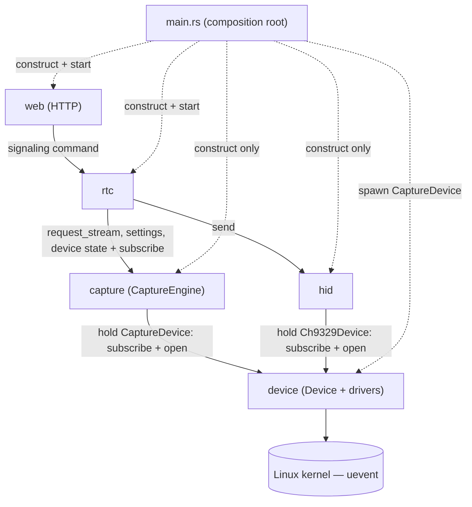

# ARCHITECTURE.md

> Source of truth for module boundaries, ownership, and communication.
> Any change that crosses a boundary here must update this document **first**, then the code.
> Device/capture internals reflect `docs/capture-redesign-ideas.md` (the target rewrite).

---

## 1. What this system is

A Linux service that turns a target machine into a browser-controllable KVM: it streams a **capture card's**
video to a browser over **WebRTC**, forwards the browser's **keyboard/mouse** to the target through a
**CH9329** USB-to-serial HID bridge, and reacts to hardware being **plugged/unplugged** at runtime. The
design mirrors the browser's own device/track model (`mediaDevices`/`getUserMedia`/`MediaStreamTrack`/
`EventTarget`), except the **server** owns the physical devices.

---

## 2. Invariants (non-negotiable)

- **I1 — One composition root.** `main.rs` only *constructs* modules and *wires* dependencies. No domain logic, no config values, no path strings. Logging setup and the startup banner are the single deliberate exception (§7).
- **I2 — Config is module-local.** Every module loads its **own** config — including its device path(s), read from its own env/config, never passed in by `main`.
- **I3 — Device paths are secret.** Only the `device` module knows or references an OS device path. Every other module reaches a device only through `Device::open()`, which returns an OS handle, **never the path**.
- **I4 — Two communication patterns only.** **Events** (callback subscriptions, `EventTarget`-style) and **commands** (async API call returning a typed result). No shared mutable globals, no reaching into another module's internals.
- **I5 — Dependencies point one way.** The graph in §4 is a DAG. No cycles, no unlisted edges.
- **I6 — Transport carries no domain logic.** The `web` module is thin HTTP: parse request → call an API → serialize response.

---

## 3. Modules

Each module lists what it is **responsible for**, **owns exclusively**, **may depend on**, and **must not** do.

### 3.1 `device` — presence & capability tracking (mirrors `navigator.mediaDevices`)

- **Responsible for:** detecting plug/unplug, probing a device's capabilities when it appears, and notifying subscribers. **Sole owner of every OS device path.**
- **How it works:** a generic `Device<D: DeviceDriver>` core (presence task + event dispatch + path encapsulation) plus per-kind **drivers** (`CaptureDriver`, `Ch9329Driver`, future UART). One instance per physical device; each reads its own path from its own config. `Device::open()` is the only path-touching call and hands back an OS handle, never the path.
- **Owns exclusively:** all device paths and path→device mapping; the generic core **and** the drivers (their `probe`/`open` is the only code that touches a path or does a raw OS open); the handle types their `open` hands back (`CaptureHandle`, the CH9329's serial port) and the capture types the capture driver produces (`Resolution`, `SupportedFormat`, `CaptureSettings` — `capture` re-exports these as part of its own API); the `devicechange` events; `open()`; the kernel uevent listener; and the `EventEmitter`/`Subscription` pair (§5.1), which it **re-exports** publicly because every `add_event_listener` in the codebase hands back a `Subscription`.
- **Handles carry what only the open could learn.** `CaptureHandle` is an already-open V4L2 device plus the resolution the driver *actually negotiated*, which is free to differ from the requested one. The negotiated value is the only one the encode loop can see, because buffers sized from the requested one read past the end of a real frame.
- **`is_present()` alongside `open()`.** A real open is neither free nor repeatable — negotiating a format can only be done by one holder at a time — so presence is also queryable on its own, for callers that must reject early (`getUserMedia`-style) without opening.
- **May depend on:** the OS/kernel only. Leaf of the graph.
- **Must not:** encode, negotiate, speak the CH9329 protocol, or run HTTP.

> ```
> trait DeviceDriver { type Info; type Settings; type Open;
>     const UEVENT_SUBSYSTEM: &str;                  // "video4linux" / "tty"
>     const PATH_ENV_VAR: &str; const DEFAULT_PATH: &str;
>     fn probe(path: &str) -> Option<Self::Info>;
>     fn open(path: &str, s: &Self::Settings) -> Result<Self::Open, OpenError>; }
> type CaptureDevice = Device<CaptureDriver>;   // wraps v4l2
> type Ch9329Device  = Device<Ch9329Driver>;    // wraps serial
> ```
> A new device kind is one more `DeviceDriver` impl, not another presence module.
>
> **Where a device lives is stated by its driver, not by its caller.** The uevent subsystem and
> the path (env var + default) describe a device *kind*, so `Device::spawn()` takes no arguments
> at all — which is what makes it impossible for a caller to hold a path (I2/I3).

### 3.2 `capture` — encode pipeline (mirrors `getUserMedia`)

- **Responsible for:** turning capture settings into a per-consumer video stream, and holding those settings and the card's UI-facing state.
- **How it works:** `CaptureEngine` holds a `CaptureDevice`. `request_stream() -> CaptureStream` returns a per-consumer stream (= `MediaStreamTrack`) carrying an `ended` event; it rejects with `NoDevice` when the device is absent (`Device::is_present`). It takes no settings — the engine owns them, and a pass is shared by every consumer, so there is only ever one set in play. The device itself is opened **once per encode pass**, by the pass, on its own blocking thread — not once per consumer: a second consumer joining a running pass must not re-open and re-negotiate a device that is already streaming. A failed open ends that pass, which fires `ended` exactly as device loss does.
- **Opening is consumer-triggered, always.** The first `request_stream` is what causes an open; presence detection and probing never do. This is a hardware constraint, not a preference — opening the card unprompted at boot has crashed the real device (see §3.1's probe-skip on the first check).
- **Settings are the engine's, in memory, never on disk.** `settings()` reads them, `update_settings(new)` applies them and fires a settings-changed event so every open tab updates live. A format is negotiated at open time, so changing settings under a running pass is impossible: the engine stops that pass and the pass's own supervisor starts the replacement once the old one has actually let go of the card. Startup defaults are decided here too — a fixed default combination, replaced by the card's first reported combination if the card turns out not to support it, and never overwritten once a person has picked settings by hand.
- **`DeviceState` is computed here, because only here has both halves.** Whether the card is usable, what it supports, and which combination is selected all follow from the probed capabilities *and* the applied settings, and `CaptureEngine` is the only thing holding both. `device_state()` reads it; a device-state event fires whenever either half moves.
- **Owns exclusively:** the encode loop (driven from the `CaptureHandle`, sizing its buffers from that handle's negotiated resolution), the frame bus the encode pass publishes to, the `CaptureStream` type and its `ended` signal, the current capture settings (held in memory) and their change event, and the `DeviceState`/`ResolutionFrameRates` types plus their change event. The bus stays private; only `FrameEnvelope`, the frame a session pulls off a stream, is re-exported.
- **May depend on:** `device` (holds a `CaptureDevice`: subscribe + `open`).
- **Must not:** know the device path; read or write settings to disk; talk to `rtc`/`hid`/`web`; own peer sessions.

### 3.3 `hid` — CH9329 keyboard/mouse bridge

- **Responsible for:** turning input — a key going down or up, the pointer moving, buttons held, the wheel moved, text to type — into CH9329 reports, sending them in the order received, and reporting whether the CH9329 is there.
- **How it works:** `Hid` spawns its own `Ch9329Device` and drain worker once its **enumeration-settle delay** has passed (`SERIAL_OPEN_DELAY_SECS`, its own config — opening the chip before USB enumeration finishes has crashed the real hardware at boot). Commands submitted during the wait queue rather than fail, so nothing else's startup waits on it. The worker opens the port through the Device API (`Device::open`, the module's only open path) and drains the internal **queue** to the CH9329 FIFO, re-checking presence per command so an unplug pauses writes and a replug resumes them.
- **Public surface:** `send(InputCommand)`, `is_present()`/`add_event_listener(cb)` (presence, forwarded from its `Ch9329Device`), and `mouse_mode()`/`set_mouse_mode()`/`add_mouse_mode_listener(cb)` — nothing else. `is_present()` is the read counterpart of the presence event, for the same reason `Device` has one: an event only fires on a transition, so a subscriber that starts later needs a way to learn where it is starting from. It answers from the last presence this module saw, so it works during the settle delay, before a `Ch9329Device` exists at all. No channel sender, no serial handle, no path escapes it. `InputCommand` names a browser `KeyboardEvent.code` or a pointer position; the translation into reports (keymap lookup, held-key tracking, report assembly, framing) happens on the way to the port.
- **Owns exclusively:** the CH9329 wire protocol/framing, the browser-code→HID-usage keymap, the held-key state and the six-key rollover it implies, the mouse mode (in memory, with a change event), the message queue, the drain worker, and the settle delay.
- **Lifetime by ownership:** `Hid` holds the only strong queue sender, so dropping it closes the queue, which ends the worker.
- **May depend on:** `device` (holds a `Ch9329Device`: subscribe + `open`).
- **Must not:** know the device path; expose the raw serial channel or its queue; expose a usage code, a modifier bitmask or a report shape to a caller; talk to `rtc`/`web`/`capture`.

> Held-key state is per **CH9329**, not per session: the chip presents one keyboard to the target, so one `Keyboard` lives in the drain worker and every session's keystrokes fold into it.

### 3.4 `rtc` — peer session manager

The module is named `rtc`, not `webrtc`: a module called `webrtc` would shadow the `webrtc` crate it
depends on.

- **Responsible for:** managing peer sessions, producing an answer from an offer, and controlling **when** media is negotiated.
- **How it works:** exposes a transport-free signaling command (`handle_offer(offer_sdp) -> Result<answer_sdp, SignalingError>`) that `web` calls; it names no HTTP type and imports nothing from the HTTP framework, so the status code and the JSON shapes are `web`'s business alone. It attaches a video track **only after** a session is `Connected` **and** the capture device is available (subscribes to presence through `CaptureEngine::add_event_listener`, calls `capture.request_stream`, renegotiates), and removes it on that stream's `ended` event. Peer input goes straight to the `hid` API, described in input terms (`InputCommand`) — no keymap lookup, no modifier bitmask, no report shape. Capture settings and `DeviceState` are read from and (for settings) written to `capture`, mouse mode from and to `hid`; the page's Save button becomes a `CaptureEngine::update_settings` call, and the state pushed down a session's `control` channel is whatever those two modules report.
- **Events and commands, per session, nothing pre-wired.** `Rtc` — the object `main` builds and `web` holds as router state — is just the `CaptureEngine` and the `Hid` handle. There is no shared bundle of channels between it and a session: each session **subscribes for itself** to capture settings, capture device state, HID presence and mouse mode when it starts, reads the current value of all four straight from the owning module when its `control` channel opens (an event only fires on a change, so it says nothing about what was already true), and calls a command to apply one. The subscriptions are **owned by the session**, so they deregister when it ends (see §5.1).
- **Every outbound `control` message goes through the session's own queue.** One task writes to `control`; the event callbacks enqueue onto it rather than writing to `control` themselves, so two producers can never reorder same-type updates on the wire. Because listeners are dispatched fire-and-forget on their own tasks, two changes in quick succession can run in either order, so a callback re-reads the current value from the owning module instead of trusting the payload it was handed — the worst case is then a duplicate of the current value rather than a tab stuck on a stale one.
- **Owns exclusively:** peer session state, signaling/renegotiation logic, media-negotiation timing, and each session's outbound `control` queue.
- **May depend on:** `capture` (`request_stream`, settings, device state, and their subscriptions), `hid` (send, mouse mode, presence, and their subscriptions).
- **Must not:** run the HTTP server, import the HTTP framework, touch device paths, hold a `Device` handle, hold the capture settings or `DeviceState` itself, or implement capture/HID logic — including translating keys or assembling reports.

### 3.5 `web` — HTTP transport & signaling front door

- **Responsible for:** serving the page on its own configured port and exposing endpoints that establish a WebRTC connection.
- **How it works:** `serve(rtc)` reads this module's own port (`HTTP_PORT`, default `3000` — I2, same as any other module's config), binds the listener and runs the server; `main` only calls it. An endpoint receives an offer, calls `rtc.handle_offer` for an answer, and returns it — mapping a `SignalingError` to `400`, the only failure status the browser ever sees here. Pure transport.
- **Owns exclusively:** the HTTP server and its port config, the listener, routing, static assets, and request/response (de)serialization — including the offer/answer wire shapes, which are HTTP payload types, not `rtc` types.
- **May depend on:** `rtc` (command) only.
- **Must not:** generate an answer, hold session/media state, validate on another module's behalf, or talk to `device`/`capture`/`hid`.

### 3.6 `main.rs` — composition root

- **Constructs:** the `CaptureDevice`, `CaptureEngine`, `Hid`, `rtc`, `web`.
- **Wires:** `CaptureEngine(capture_device)`, `rtc(capture_engine, hid)`, `web(rtc)`.
- **Starts:** the capture card's presence task (via `CaptureDevice::spawn`) and the page server (via `web::serve`, which owns the port and the listener). `Rtc` is constructed, not started — a session begins when an offer arrives. `CaptureEngine` is a passive factory; `Hid` spawns its own `Ch9329Device` and worker after its settle delay, so `main` starts no HID task.
- **Plus, deliberately:** logging setup and the startup banner, and nothing else — see §7 for why they stay.
- **Must not:** configure any module, pass any device path (each `Device` reads its own), or contain domain logic. It holds no environment read, no port, no default resolution/frame rate/mouse mode, and constructs no channel. It has no fallible step of its own — every error belongs to the module that can act on it — so `main` returns `()`, not a `Result`.

---

## 4. Dependency graph

`A --> B` means **A may depend on B**. DAG; no other edges.



| From | To | Kind |
|------|-----|------|
| `capture` | `device` | holds `CaptureDevice` — subscribe + `open` |
| `hid` | `device` | holds `Ch9329Device` — subscribe + `open` |
| `rtc` | `capture` | command (`request_stream`, `settings`/`update_settings`, `device_state`) + subscribe presence/settings/device state |
| `rtc` | `hid` | command (`send`, `is_present`, mouse mode) + subscribe presence/mouse mode |
| `web` | `rtc` | command (signaling) |
| `main` | all | construct/wire/start only |

**There is no `rtc → device` edge.** Sessions learn about the capture card through
`CaptureEngine::add_event_listener` and about the CH9329 through `Hid::add_event_listener`, each
forwarding the `Device<D>` events of the device that module already holds. One module owning the
device handle and re-exposing its events is one edge fewer than `rtc` holding a second handle, so
`rtc` must not grow one. `rtc` does name `device::DeviceStatus` and `device::Subscription`, but
those are type-only imports — the payload type and the handle type of the subscriptions `capture`
and `hid` hand it — not a dependency edge.

Anything not in this table is a violation — including `web → device/capture/hid`, `capture → rtc`,
`hid → rtc`, and any edge into `device` other than subscribe/open.

---

## 5. Communication patterns

### 5.1 Events — callback subscriptions (`EventTarget`-style) **[decided]**

- One `EventEmitter<T>` per event kind (typed payload; a mismatch is a compile error, not a silent no-op). Publishers include `Device` (`devicechange`), `CaptureStream` (`ended`), `CaptureEngine` (settings changed, device state changed, plus its device's `devicechange` forwarded), and `Hid` (mouse mode changed, plus its device's `devicechange` forwarded).
- The emitter is **not** a shared utility module: it lives in `device` (§3.1), whose `devicechange` events are its reason to exist, and is re-exported from there. `capture` and `rtc` reach it over the `capture → device` / type-only-`device` imports they already have, so it costs no extra edge.
- `add_event_listener(cb) -> Subscription`. The `Subscription` **auto-deregisters on drop** (mirrors `removeEventListener`) — no manual cleanup to forget, no listener left calling into dropped state.
- `dispatch` fires each listener via its own `tokio::spawn`, **fire-and-forget, no join**, so one slow or broken listener can't stall another listener or the caller.
- **Not** a pull-based `watch` channel, and **not** Rayon/OS-thread dispatch — that path (see `docs/parallel-event-callbacks-rust.md`) was evaluated and rejected because these callbacks are async I/O, not CPU-heavy. If a specific listener body *is* CPU-heavy, wrap it in `spawn_blocking`/Rayon rather than changing the dispatch model.

### 5.2 Commands — direct API

- A caller invokes a callee's public async API (expressed as a **trait/port**) and awaits a typed result or error: `device.open(settings)` / `device.is_present()`, `capture.request_stream()` / `capture.update_settings(new)`, `hid.send(input)` / `hid.is_present()` / `hid.set_mouse_mode(mode)`, `rtc.handle_offer(offer)`.

---

## 6. Lifecycle

1. `main` initialises logging and prints the banner (§7), spawns the `CaptureDevice` (which reads its own path and begins its presence task), constructs and wires the rest, and calls `web::serve`, which reads its own port, binds and runs until the process ends. `Hid` accepts commands immediately; it spawns its own `Ch9329Device` and drain worker once its settle delay has passed.
2. Capture card plugged → `CaptureDevice` probes → dispatches `devicechange`, which `CaptureEngine` forwards to its own subscribers. For each `Connected` session, `rtc` calls `capture.request_stream`, `add_track`s, and renegotiates; the encode pass starts, and *that* is what opens the card (`Device::open` → `CaptureHandle`).
3. Browser hits the `web` signaling endpoint → `web` calls `rtc.handle_offer` → returns the answer.
4. The session's `control` channel opens → it reads the current capture settings, capture device state, HID presence and mouse mode from `capture` and `hid` and pushes them to that tab, once. From then on its own subscriptions push every change, so an already-open tab follows a hot-plug or another tab's Save with no reload. The Save button itself is a command back the other way (`capture.update_settings` / `hid.set_mouse_mode`), and the change event that follows is what echoes it to every tab, including the one that saved.
5. Peer input arrives → `rtc` calls `hid.send` with what the peer did → the drain worker translates it into a CH9329 report and writes it, in order.
6. Card unplugged → every live `CaptureStream` fires `ended` → each session `remove_track`s + renegotiates → the encoder stops.
7. **Shutdown needs no special path.** Runtime shutdown drops each session task, whose destructors drop the peer connection, video track, `CaptureStream` and that session's four state subscriptions together — the same **ownership cascade** as one browser disconnecting. Dropping the subscriptions deregisters their listeners, which drops the last senders on that session's outbound queue, which ends its relay task. `CaptureEngine` does keep a live count (`LiveCount { count, pass_running }`), but it is decremented from `LiveMarker`'s `Drop`, so it is driven by ownership rather than by callers remembering to decrement. The encoder stops when that count reaches zero, which happens as part of the cascade.

---

## 7. Cross-cutting rules

- **Config & paths:** each module loads its own config; each `Device` reads its own path. `rg '/dev/'` matches only inside the `device` module (see §8 check 1 for the exact command).
- **Errors:** typed per module; callers handle them. No panics or `unwrap()` on fallible I/O in library code.
- **Async:** all waits are async; never block an async task, never hold a lock across `.await`.
- **Handles:** OS handles expose I/O only; they never expose or stringify the path.
- **Logging lives in the composition root, on purpose.** `main.rs` initialises `tracing` and prints the startup banner. Process-level observability is not domain logic, and the composition root *is* the process, so this is the one thing there that is neither construct, wire, nor start. Its `DEFAULT_LOG_FILTER` names two modules by path on purpose — `simple_kvm::rtc::session` and `simple_kvm::hid::writer` at `debug`, everything else at `info` — so an input-lag report is readable straight out of the log with no configuration step first. Setting `RUST_LOG` still overrides it entirely. Do not remove those module paths as a boundary violation; when a module is renamed or moved, update them so the default keeps working.
- **Naming a concrete type is not a dependency edge.** A composition root has to name `CaptureDevice`, `CaptureEngine`, `Hid`, `Rtc` and `web::serve` to construct and wire them; that is what a composition root is for. §4 constrains what the *modules* import from each other, so `main.rs`'s imports are not measured against it and any automated boundary check must exempt them.

---

## 8. Enforcement

**`./check-architecture.sh` runs these checks**, and CI runs it on every push and pull request
(`.github/workflows/test.yml`), before the build, so a violation fails the job. It exits non-zero
naming the file, the line and the invariant that broke.

Checks 1–3 it decides entirely. Checks 4 and 5 are partly a judgement call, so it proves only the
mechanical half of each and prints, on every run, which half that is — **a green run is not proof
that all five hold**. What it does not decide: that the body of `main` only constructs, wires and
starts, and that every `web` handler body is free of SDP/media/HID logic and ends in an `rtc` call.
Those still need a reviewer.

The script encodes the exceptions recorded above — `main.rs` is exempt from check 2 entirely (§7:
naming a concrete type to construct it is not a dependency edge), and `rtc` may name
`device::DeviceStatus` and `device::Subscription` and nothing else out of `device` (§4). `main.rs`'s
logging setup and startup banner (§7) are the only functions check 4 permits there besides `main`.
When one of those exceptions changes here, change it in the script too.

The `device` module is a directory (`src/device/`); check 1 excludes both that and the older
single-file spelling (`src/device.rs`) so it keeps working either way. The same applies to any
other module named below.

1. **Path secrecy (I3):** `rg '/dev/' src --glob '!src/device.rs' --glob '!src/device/**'` returns nothing, and so does the same search for device `*_PATH` env reads (`rg '_PATH' src --glob '!src/device.rs' --glob '!src/device/**'`).
2. **Dependency edges (I5):** each module's cross-module `use crate::` matches only §4. `web` imports only `rtc`; `capture`/`hid` import only `device`; `rtc` imports only `capture` and `hid` (plus `device::DeviceStatus` and `device::Subscription`, the type-only payload and handle of the subscriptions `capture` and `hid` hand it — see §4); `device` imports no sibling.
3. **Config locality (I2):** module config, paths included, is defined and read inside that module; `main.rs` has no config literals or path strings — `rg 'env::var|/dev/' src/main.rs` returns nothing.
4. **Composition root (I1):** `main.rs` is construct/wire/start only, apart from the logging setup and startup banner of §7. It declares the modules, builds them, hands each its dependencies, and awaits `web::serve`; it defines no other function.
5. **Web is thin (I6):** no SDP/media/HID logic in `web`; every handler ends in an `rtc` call. The HTTP server itself lives in `web` — `rg 'axum|TcpListener' src --glob '!src/web/**'` returns nothing.

### Recommended structure

A Cargo **workspace with one crate per module** (`device`, `capture`, `hid`, `rtc`, `web`, thin `main`) makes I5 a **compile error** on violation and each crate's public API exactly its port. The generic `Device<D>` core and all `DeviceDriver` impls live in the `device` crate. Single-crate is possible with `pub(crate)` discipline plus the checks above.